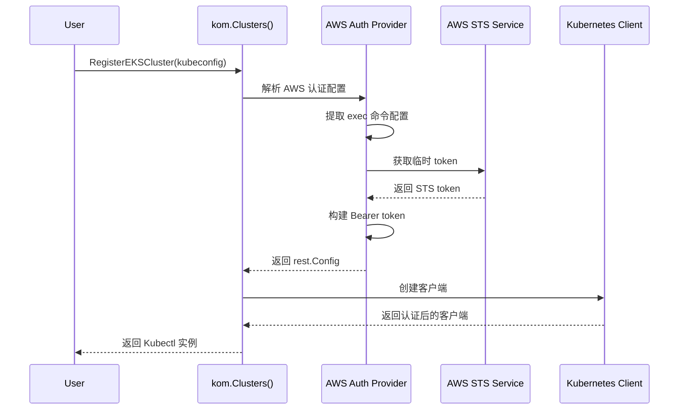
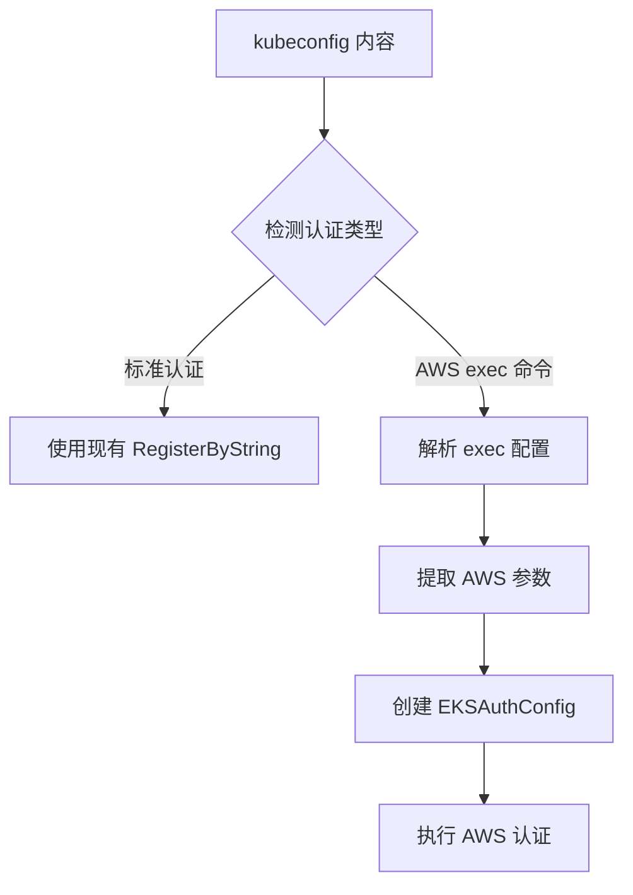
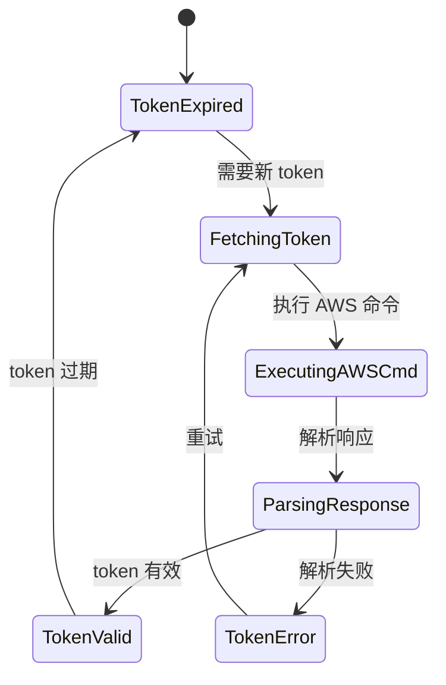

# AWS EKS 集群支持设计文档

## 概述

本设计文档描述了如何为 kom 项目增加对 AWS EKS（Elastic Kubernetes Service）集群的支持。AWS EKS 使用 AWS IAM 作为认证机制，并通过自定义的认证插件来处理 token 的获取和解密，这与标准的 kubeconfig 认证方式有所不同。

### 目标

- 支持 AWS EKS 集群的自动认证
- 集成 AWS IAM 身份验证机制
- 提供透明的 token 刷新和解密功能
- 保持与现有集群管理接口的兼容性

### 关键挑战

- AWS EKS 使用动态 token 认证，需要调用 AWS STS 服务获取临时凭证
- kubeconfig 中包含 AWS CLI 命令或认证插件，需要解析和执行
- token 有时效性，需要自动刷新机制

## 技术架构

### 核心组件设计



### 数据结构扩展

#### EKS 认证配置结构

```go
// EKSAuthConfig AWS EKS 认证配置
type EKSAuthConfig struct {
    ClusterName   string            // EKS 集群名称
    Region        string            // AWS 区域
    Profile       string            // AWS Profile (可选)
    RoleARN       string            // 要承担的 IAM 角色 ARN (可选)
    ExecConfig    *ExecConfig       // exec 命令配置
    TokenCache    *TokenCache       // token 缓存
}

// ExecConfig 执行命令配置
type ExecConfig struct {
    Command string            // 命令 (如 aws)
    Args    []string          // 参数列表
    Env     map[string]string // 环境变量
}

// TokenCache token 缓存
type TokenCache struct {
    Token     string        // Bearer token
    ExpiresAt time.Time     // 过期时间
    mutex     sync.RWMutex  // 读写锁
}
```

#### 集群实例扩展

```go
// ClusterInst 扩展
type ClusterInst struct {
    // ... 现有字段
    
    // AWS EKS 特定字段
    EKSAuth       *EKSAuthConfig    // EKS 认证配置
    tokenRefresh  context.CancelFunc // token 刷新取消函数
}
```

### 认证流程设计

#### 1. kubeconfig 解析



#### 2. token 获取与刷新



## 实现方案

### 1. 依赖项添加

向 `go.mod` 添加 AWS SDK 依赖：

```go
require (
    github.com/aws/aws-sdk-go-v2 v1.25.0
    github.com/aws/aws-sdk-go-v2/config v1.26.0
    github.com/aws/aws-sdk-go-v2/service/sts v1.26.0
    github.com/aws/aws-sdk-go-v2/service/eks v1.35.0
)
```

### 2. 核心接口设计

#### AWS 认证提供者接口

```go
// AWSAuthProvider AWS 认证提供者接口
type AWSAuthProvider interface {
    // GetToken 获取认证 token
    GetToken(ctx context.Context) (string, time.Time, error)
    // RefreshToken 刷新 token
    RefreshToken(ctx context.Context) error
    // IsEKSConfig 检测是否为 EKS 配置
    IsEKSConfig(kubeconfig []byte) bool
}
```

#### 集群注册方法扩展

```go
// RegisterEKSByString 通过 kubeconfig 字符串注册 EKS 集群
func (c *ClusterInstances) RegisterEKSByString(str string) (*Kubectl, error)

// RegisterEKSByStringWithID 通过 kubeconfig 字符串注册 EKS 集群 (带 ID)
func (c *ClusterInstances) RegisterEKSByStringWithID(str string, id string) (*Kubectl, error)

// RegisterEKSByPath 通过 kubeconfig 文件路径注册 EKS 集群
func (c *ClusterInstances) RegisterEKSByPath(path string) (*Kubectl, error)

// RegisterEKSByPathWithID 通过 kubeconfig 文件路径注册 EKS 集群 (带 ID)
func (c *ClusterInstances) RegisterEKSByPathWithID(path string, id string) (*Kubectl, error)
```

### 3. 文件组织结构

```
kom/
├── aws/
│   ├── auth.go          # AWS 认证实现
│   ├── config.go        # AWS 配置解析
│   ├── exec.go          # exec 命令执行
│   └── token.go         # token 管理
├── cluster.go           # 现有集群管理 (扩展)
└── cluster_aws.go       # AWS EKS 特定实现
```

### 4. 核心实现模块

#### AWS 认证解析器

```go
// ParseEKSConfig 解析 EKS kubeconfig
func ParseEKSConfig(kubeconfigData []byte) (*EKSAuthConfig, error) {
    config, err := clientcmd.Load(kubeconfigData)
    if err != nil {
        return nil, err
    }
    
    // 检查 exec 配置
    for _, authInfo := range config.AuthInfos {
        if authInfo.Exec != nil {
            return parseExecConfig(authInfo.Exec)
        }
    }
    
    return nil, fmt.Errorf("no AWS exec config found")
}
```

#### Token 管理器

```go
// TokenManager AWS token 管理器
type TokenManager struct {
    eksConfig *EKSAuthConfig
    cache     *TokenCache
    awsConfig aws.Config
}

// GetValidToken 获取有效 token
func (tm *TokenManager) GetValidToken(ctx context.Context) (string, error) {
    tm.cache.mutex.RLock()
    if tm.cache.Token != "" && time.Now().Before(tm.cache.ExpiresAt) {
        defer tm.cache.mutex.RUnlock()
        return tm.cache.Token, nil
    }
    tm.cache.mutex.RUnlock()
    
    return tm.refreshToken(ctx)
}
```

#### 自动刷新机制

```go
// startTokenRefresh 启动 token 自动刷新
func (ci *ClusterInst) startTokenRefresh(ctx context.Context) {
    if ci.EKSAuth == nil {
        return
    }
    
    ticker := time.NewTicker(10 * time.Minute) // 每10分钟检查一次
    go func() {
        defer ticker.Stop()
        for {
            select {
            case <-ctx.Done():
                return
            case <-ticker.C:
                if needsRefresh(ci.EKSAuth.TokenCache) {
                    _ = ci.refreshEKSToken(ctx)
                }
            }
        }
    }()
}
```

### 5. 配置示例

#### 标准 EKS kubeconfig

```yaml
apiVersion: v1
clusters:
- cluster:
    certificate-authority-data: LS0t...
    server: https://ABC123.gr7.us-east-1.eks.amazonaws.com
  name: my-eks-cluster
contexts:
- context:
    cluster: my-eks-cluster
    user: my-eks-user
  name: my-eks-context
current-context: my-eks-context
users:
- name: my-eks-user
  user:
    exec:
      apiVersion: client.authentication.k8s.io/v1beta1
      command: aws
      args:
      - eks
      - get-token
      - --cluster-name
      - my-cluster
      - --region
      - us-east-1
      env:
      - name: AWS_PROFILE
        value: default
```

#### 使用方式

```go
// 自动检测并注册 EKS 集群
kubeconfig := `...` // EKS kubeconfig 内容
kubectl, err := kom.Clusters().RegisterByString(kubeconfig)

// 或明确指定为 EKS 集群
kubectl, err := kom.Clusters().RegisterEKSByString(kubeconfig)
```

## API 扩展

### MCP 工具集成

扩展现有的 MCP 工具，支持 EKS 集群注册：

```go
// RegisterEKSClusterTool 注册 EKS 集群工具
func RegisterEKSClusterTool() {
    tools.RegisterTool("register_eks_cluster", tools.Tool{
        Name:        "register_eks_cluster",
        Description: "Register AWS EKS cluster with automatic authentication",
        Parameters: map[string]interface{}{
            "type": "object",
            "properties": map[string]interface{}{
                "kubeconfig": map[string]interface{}{
                    "type":        "string",
                    "description": "EKS kubeconfig content or file path",
                },
                "cluster_id": map[string]interface{}{
                    "type":        "string", 
                    "description": "Unique cluster identifier",
                },
            },
            "required": []string{"kubeconfig"},
        },
        Handler: handleEKSClusterRegistration,
    })
}
```

### 错误处理策略

```go
// EKS 特定错误类型
type EKSAuthError struct {
    Type    string // TokenExpired, AWSConfigMissing, ExecFailed
    Message string
    Cause   error
}

// 错误处理和重试逻辑
func (tm *TokenManager) handleAuthError(err error) error {
    switch {
    case isTokenExpiredError(err):
        return tm.refreshToken(context.Background())
    case isAWSConfigError(err):
        return fmt.Errorf("AWS configuration error: %w", err)
    default:
        return err
    }
}
```

## 安全考虑

### 1. 凭证管理

- 不在内存中长期存储 AWS 凭证
- 使用 AWS SDK 的标准凭证链
- 支持 IAM 角色和临时凭证

### 2. Token 安全

- token 缓存使用内存存储，进程退出时自动清理
- 设置合理的 token 过期时间
- 支持强制刷新机制

### 3. 网络安全

- 使用 HTTPS 与 AWS 服务通信
- 验证 SSL 证书
- 支持代理配置

## 测试策略

### 1. 单元测试

```go
// TestEKSConfigParsing 测试 EKS 配置解析
func TestEKSConfigParsing(t *testing.T) {
    kubeconfig := `...` // 测试用 EKS kubeconfig
    
    config, err := ParseEKSConfig([]byte(kubeconfig))
    assert.NoError(t, err)
    assert.Equal(t, "my-cluster", config.ClusterName)
    assert.Equal(t, "us-east-1", config.Region)
}

// TestTokenRefresh 测试 token 刷新
func TestTokenRefresh(t *testing.T) {
    // Mock AWS STS 服务
    // 测试 token 获取和刷新逻辑
}
```

### 2. 集成测试

```go
// TestEKSClusterRegistration 测试 EKS 集群注册
func TestEKSClusterRegistration(t *testing.T) {
    // 需要真实的 AWS 环境和 EKS 集群
    kubeconfig := getTestEKSKubeconfig()
    
    kubectl, err := kom.Clusters().RegisterEKSByString(kubeconfig)
    assert.NoError(t, err)
    assert.NotNil(t, kubectl)
    
    // 测试基本操作
    var pods []v1.Pod
    err = kubectl.Resource(&v1.Pod{}).List(&pods).Error
    assert.NoError(t, err)
}
```

### 3. 性能测试

- token 获取性能测试
- 并发访问性能测试
- 内存使用率测试

## 向后兼容性

### 1. 接口兼容

- 现有的 `RegisterByString` 等方法保持不变
- 自动检测配置类型，透明支持 EKS
- 不影响现有非 EKS 集群的功能

### 2. 配置兼容

- 支持标准 kubeconfig 格式
- 支持 AWS CLI 生成的配置
- 兼容不同版本的 AWS CLI 输出格式

## 监控和调试

### 1. 日志记录

```go
// 使用结构化日志记录 AWS 认证过程
klog.V(2).InfoS("EKS token refresh", 
    "cluster", config.ClusterName,
    "region", config.Region,
    "expires_at", expiresAt)
```

### 2. 指标收集

- token 刷新次数
- 认证失败次数
- token 有效期统计

### 3. 故障排查

- 详细的错误信息
- AWS 凭证状态检查
- 网络连接状态检查